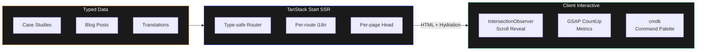
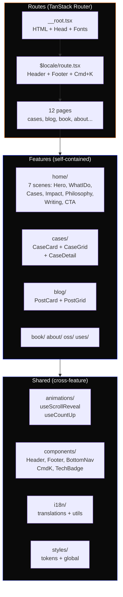

> **[Portugues](README.md)** | English

<div align="center">

# portfolio-v2

**Bilingual Staff Engineer portfolio with a cinematic 7-scene home page, scroll-driven animations, and full SSR.**

[](https://react.dev)
[](https://tanstack.com/start)
[](https://tailwindcss.com)
[](https://www.typescriptlang.org)
[](LICENSE)

**55 files** &bull; **7 home scenes** &bull; **12 routes** &bull; **4K lines** &bull; **Bilingual EN/PT-BR**

</div>

---

## Table of Contents

- [Why not a template?](#why-not-a-template)
- [How it works](#how-it-works)
- [Architecture](#architecture)
- [Project structure](#project-structure)
- [Quick Start](#quick-start)
- [Stack](#stack)
- [Color system](#color-system)
- [Design principles](#design-principles)

## Why not a template?

Portfolio templates deliver a generic site in 5 minutes. This project delivers a portfolio that **is the proof of competence** — every technical decision demonstrates what you know.

| | Generic Template | This Portfolio |
|---|---|---|
| **SSR** | None or Next.js full | TanStack Start with Vite 7 |
| **Animations** | Ready-made libs or none | IntersectionObserver + GSAP countup |
| **i18n** | External plugin | `as const` type-safe, zero runtime |
| **Routing** | Basic file-based | TanStack Router type-safe |
| **Home** | Static section list | 7 scenes with scroll reveal |
| **Mobile** | Hamburger menu | Bottom nav (Instagram-style) |
| **Cmd+K** | None | Command palette with easter eggs |
| **Content** | Generic markdown | Typed data + Zod-like schemas |

## How it works



## Architecture



### Home: 7 Scenes

| Scene | Component | Effect |
|---|---|---|
| 1 | Hero | CSS fadeInUp staggered on load |
| 2 | WhatIDo | 4 capabilities with scroll reveal |
| 3 | FeaturedCases | 3-card grid with hover glow |
| 4 | ImpactNumbers | Animated countup (IntersectionObserver) |
| 5 | Philosophy | Text with highlighted phrases |
| 6 | RecentWriting | 4-post grid with stagger |
| 7 | ContactCTA | CTA with mailto |

## Project structure

```
src/
├── features/
│   ├── home/           # 7 scenes: Hero, WhatIDo, FeaturedCases...
│   ├── cases/          # CaseCard, CaseGrid, CaseDetail, data.ts
│   ├── blog/           # PostCard, PostGrid, data.ts
│   ├── book/           # BookHero
│   ├── about/          # AboutContent, ImpactMetrics
│   ├── oss/            # OssGrid
│   └── uses/           # UsesGrid
├── shared/
│   ├── animations/     # useScrollReveal, useCountUp
│   ├── components/     # Header, Footer, BottomNav, CmdK, TechBadge
│   ├── i18n/           # translations.ts (as const), utils.ts
│   ├── styles/         # tokens.css (@theme), global.css
│   └── types/          # Locale type
├── routes/
│   ├── __root.tsx      # HTML shell, fonts, JSON-LD
│   └── $locale/        # All locale-prefixed routes
└── styles/app.css      # Entry: Tailwind + tokens
```

## Quick Start

```bash
git clone git@github.com:Felipeness/portfolio-v2-react.git
cd portfolio-v2-react
pnpm install
pnpm dev
# → http://localhost:3000/en
```

## Stack

<details>
<summary><strong>Dependencies and their roles</strong></summary>

| Package | Role |
|---|---|
| `react` 19 | UI framework with compiler |
| `@tanstack/react-start` | SSR + file-based routing |
| `@tanstack/react-router` | Type-safe routing with params |
| `tailwindcss` 4 | CSS-first design tokens via @theme |
| `gsap` 3.14 | Number countup animation only |
| `cmdk` | Command palette (Cmd+K) |
| `vite` 7 | Build + dev server |
| `typescript` 5.9 | Strict type safety |

</details>

## Color system

| Token | Dark | Light | Usage |
|---|---|---|---|
| `--color-orange` | `#E56500` | `#C25500` | Primary accent |
| `--color-brand-blue` | `#0119E5` | `#0119E5` | Secondary |
| `--color-brand-red` | `#E61100` | `#E61100` | Tertiary |
| `--gradient-warm` | `#E56500 → #E61100` | — | Headlines |

60-30-10 rule: black (bg) · white (text) · orange (accent).

## Design principles

1. **The portfolio is the proof** — Every technical decision demonstrates competence. TanStack Start for SSR, IntersectionObserver for animations, `as const` for type-safe i18n.

2. **Content visible, animation optional** — If JS fails, all content appears. Animations are progressive enhancement via IntersectionObserver.

3. **Feature-based** — Components, data, and types live together by domain. Zero barrel files.

4. **Mobile-first** — App-style bottom nav, responsive padding, adaptive grids.

## License

MIT

---

<div align="center">

**[felipeness.dev](https://felipeness.dev)** · React 19 + TanStack Start

</div>
