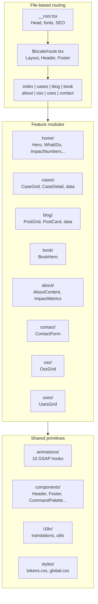

<p align="right"><a href="./README.md">Portugues</a></p>

<h1 align="center">portfolio-v2</h1>

<p align="center">
  Personal portfolio with cinematic scroll, GSAP animations, and SSR via TanStack Start.
</p>

<p align="center">
  
  
  
  
  
</p>

---

## Metrics

| Metric | Value |
|--------|-------|
| Source files | 60+ |
| Scroll scenes (home) | 7 |
| Animation hooks | 10 |
| Languages | EN / PT-BR |
| Themes | Dark / Light |

## Quick Start

```bash
git clone https://github.com/felipeness/portfolio-v2.git
cd portfolio-v2
pnpm install
pnpm dev
```

Open `http://localhost:3000`.

## Architecture



## Project structure

```
src/
├── features/           # Domain modules
│   ├── about/          # AboutContent, ImpactMetrics
│   ├── blog/           # PostCard, PostGrid, data
│   ├── book/           # BookHero
│   ├── cases/          # CaseCard, CaseDetail, CaseGrid, data
│   ├── contact/        # ContactForm
│   ├── home/           # Hero, WhatIDo, FeaturedCases, ImpactNumbers, Philosophy, RecentWriting, ContactCTA
│   ├── oss/            # OssGrid
│   └── uses/           # UsesGrid
├── routes/             # File-based routing (TanStack Router)
│   ├── __root.tsx      # Root layout, SEO, fonts
│   ├── index.tsx       # Redirect / -> /en
│   └── $locale/        # Localized routes
│       ├── route.tsx   # Layout with Header/Footer
│       ├── index.tsx   # Home page
│       ├── cases/      # List + detail
│       ├── blog/       # List + detail
│       ├── book.tsx
│       ├── about.tsx
│       ├── oss.tsx
│       ├── uses.tsx
│       └── contact.tsx
├── shared/
│   ├── animations/     # 10 GSAP hooks (scroll, reveal, split text, count up...)
│   ├── components/     # Header, Footer, ThemeToggle, LanguageToggle, CommandPalette, SectionHeader, GradientText
│   ├── i18n/           # EN/PT-BR translations + utils
│   ├── styles/         # Design tokens + global CSS
│   └── types/          # Locale type
└── styles/
    └── app.css         # Tailwind + imports
```

## Stack

| Layer | Technology | Purpose |
|-------|-----------|---------|
| Framework | React 19 + TanStack Start | SSR, file-based routing, head management |
| Animation | GSAP 3.14 + ScrollTrigger | Scroll-driven animations, split text, parallax |
| Smooth scroll | Lenis | Inertia scrolling |
| Styling | Tailwind CSS v4 | Utility-first, design tokens via `@theme` |
| Bundler | Vite 7 | Dev server, HMR, build |
| Command palette | cmdk | Cmd+K navigation |
| Language | TypeScript 5.9 | End-to-end type safety |

## Color system

| Token | Dark | Usage |
|-------|------|-------|
| `--color-orange` | `#E56500` | CTA, accent, brand |
| `--color-brand-blue` | `#0119E5` | Secondary accent |
| `--color-bg-base` | `#000000` | Background |
| `--color-bg-surface` | `#111111` | Cards, surfaces |
| `--color-text-primary` | `#FFFFFF` | Headings |
| `--color-text-secondary` | `#E5E5E5` | Body text |
| `--color-text-muted` | `#808080` | Labels, metadata |

Fonts: **Space Grotesk** (headings), **Inter** (body), **JetBrains Mono** (code).

## License

MIT
