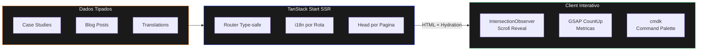
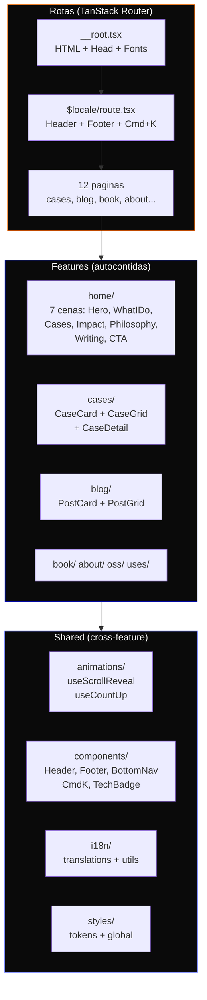

> Portugues | **[English](README.en.md)**

<div align="center">

# portfolio-v2

**Portfolio bilingue de Staff Engineer com home cinematica de 7 cenas, animacoes scroll-driven e SSR completo.**

[](https://react.dev)
[](https://tanstack.com/start)
[](https://tailwindcss.com)
[](https://www.typescriptlang.org)
[](LICENSE)

**55 arquivos** &bull; **7 cenas na home** &bull; **12 rotas** &bull; **4K linhas** &bull; **Bilingue EN/PT-BR**

</div>

---

## Indice

- [Por que nao um template?](#por-que-nao-um-template)
- [Como funciona](#como-funciona)
- [Arquitetura](#arquitetura)
- [Estrutura do projeto](#estrutura-do-projeto)
- [Quick Start](#quick-start)
- [Stack](#stack)
- [Sistema de cores](#sistema-de-cores)
- [Principios de design](#principios-de-design)

## Por que nao um template?

Templates de portfolio entregam um site generico em 5 minutos. Esse projeto entrega um portfolio que **e a prova de competencia** — cada decisao tecnica demonstra o que voce sabe.

| | Template Generico | Este Portfolio |
|---|---|---|
| **SSR** | Nenhum ou Next.js full | TanStack Start com Vite 7 |
| **Animacoes** | Libs prontas ou nenhuma | IntersectionObserver + GSAP countup |
| **i18n** | Plugin externo | `as const` type-safe, zero runtime |
| **Rotas** | File-based basico | TanStack Router type-safe |
| **Home** | Lista de secoes estaticas | 7 cenas com scroll reveal |
| **Mobile** | Hamburger menu | Bottom nav (Instagram-style) |
| **Cmd+K** | Nenhum | Command palette com easter eggs |
| **Conteudo** | Markdown generico | Dados tipados + Zod-like schemas |

## Como funciona



## Arquitetura



### Home: 7 Cenas

| Cena | Componente | Efeito |
|---|---|---|
| 1 | Hero | CSS fadeInUp staggered no load |
| 2 | WhatIDo | 4 capabilities com scroll reveal |
| 3 | FeaturedCases | Grid de 3 cases com hover glow |
| 4 | ImpactNumbers | CountUp animado (IntersectionObserver) |
| 5 | Philosophy | Texto com frases destacadas |
| 6 | RecentWriting | Grid de 4 posts com stagger |
| 7 | ContactCTA | CTA com mailto |

## Estrutura do projeto

```
src/
├── features/
│   ├── home/           # 7 cenas: Hero, WhatIDo, FeaturedCases, etc.
│   ├── cases/          # CaseCard, CaseGrid, CaseDetail, data.ts
│   ├── blog/           # PostCard, PostGrid, data.ts
│   ├── book/           # BookHero
│   ├── about/          # AboutContent, ImpactMetrics
│   ├── oss/            # OssGrid
│   └── uses/           # UsesGrid
├── shared/
│   ├── animations/     # useScrollReveal, useCountUp (IntersectionObserver)
│   ├── components/     # Header, Footer, BottomNav, CommandPalette, TechBadge
│   ├── i18n/           # translations.ts (as const), utils.ts
│   ├── styles/         # tokens.css (@theme), global.css
│   └── types/          # Locale type
├── routes/
│   ├── __root.tsx      # HTML shell, fonts, JSON-LD
│   ├── $locale/
│   │   ├── route.tsx   # Layout: Header + Footer + Cmd+K + BottomNav
│   │   ├── index.tsx   # Home (7 cenas)
│   │   ├── cases/      # Listagem + detalhe
│   │   ├── blog/       # Listagem + detalhe
│   │   ├── book.tsx    # Showcase do livro
│   │   ├── about.tsx   # Bio + metricas
│   │   ├── oss.tsx     # Contribuicoes
│   │   └── uses.tsx    # Setup e ferramentas
│   └── index.tsx       # Redirect → /en
└── styles/app.css      # Entry: Tailwind + tokens
```

## Quick Start

```bash
git clone git@github.com:Felipeness/portfolio-v2-react.git
cd portfolio-v2-react
pnpm install
pnpm dev
# → http://localhost:3000/en
```

## Stack

<details>
<summary><strong>Dependencias e suas funcoes</strong></summary>

| Pacote | Funcao |
|---|---|
| `react` 19 | UI framework com compiler |
| `@tanstack/react-start` | SSR + file-based routing |
| `@tanstack/react-router` | Type-safe routing com params |
| `tailwindcss` 4 | CSS-first design tokens via @theme |
| `gsap` 3.14 | Apenas countup de numeros |
| `cmdk` | Command palette (Cmd+K) |
| `vite` 7 | Build + dev server |
| `typescript` 5.9 | Type safety strict |

</details>

## Sistema de cores

| Token | Dark | Light | Uso |
|---|---|---|---|
| `--color-orange` | `#E56500` | `#C25500` | Accent principal |
| `--color-brand-blue` | `#0119E5` | `#0119E5` | Secundario |
| `--color-brand-red` | `#E61100` | `#E61100` | Terciario |
| `--gradient-warm` | `#E56500 → #E61100` | — | Headlines |

Regra 60-30-10: preto (bg) · branco (texto) · laranja (accent).

## Principios de design

1. **O portfolio e a prova** — Cada decisao tecnica demonstra competencia. TanStack Start para SSR, IntersectionObserver para animacoes, `as const` para i18n type-safe.

2. **Conteudo visivel, animacao opcional** — Se JS falhar, todo conteudo aparece. Animacoes sao progressive enhancement via IntersectionObserver.

3. **Feature-based** — Componentes, dados e tipos vivem juntos por dominio. Zero barrel files.

4. **Mobile-first** — Bottom nav estilo app, padding responsivo, grids adaptivos.

## License

MIT

---

<div align="center">

**[felipeness.dev](https://felipeness.dev)** · React 19 + TanStack Start

</div>
